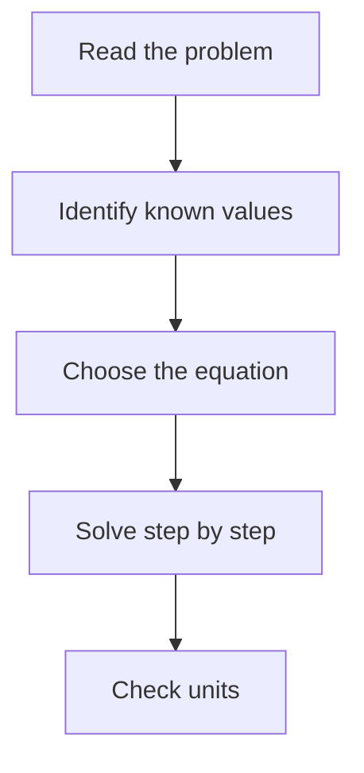

# Transport Phenomena Learning Workspace

This project is a personal learning workspace for the HID-31 Transport Phenomena class at Instituto Tecnologico de Aeronautica.

The goal is to use teacher materials, such as PDFs, slides, documents, images, and exercises, to learn transport phenomena topics and create review materials for later.

## How To Use This Project

- Add source materials from classes, such as PDFs, slides, documents, and images.
- Create notes from those materials.
- Use Markdown (`.md`) for notes and summaries.
- Keep notes organized by class, topic, or source.
- Add diagrams when a process or system has many steps.
- Add examples after theory.
- Create review summaries and questions for later study.

## Suggested Structure

```text
.
+-- README.md
+-- AGENTS.md
+-- sources/
|   +-- class-material.pdf
+-- notes/
|   +-- topic-name.md
+-- diagrams/
|   +-- topic-flow.md
+-- exercises/
|   +-- topic-exercises.md
+-- reviews/
    +-- topic-review.md
```

The folders above are suggestions. They can be created when needed.

## Note Template

```markdown
# Topic Name

## Source
- File:
- Class:
- Teacher:
- Date:

## Goal
What I want to understand.

## Key Ideas
- Important idea 1
- Important idea 2

## Definitions
- **Term:** simple explanation.

## Formula
`formula here`

Where:
- `symbol`: meaning and unit

## Example
Step-by-step example.

## Common Mistakes
- Mistake 1
- Mistake 2

## Summary
Short review of the topic.

## Questions To Review
- Question 1
- Question 2
```

## Diagram Example

Mermaid diagrams can be used for flows:



## Review Materials

Review files should be short and useful before tests or exercises.

They can include:

- key formulas
- important definitions
- common mistakes
- solved examples
- questions to practice
- links to source files
