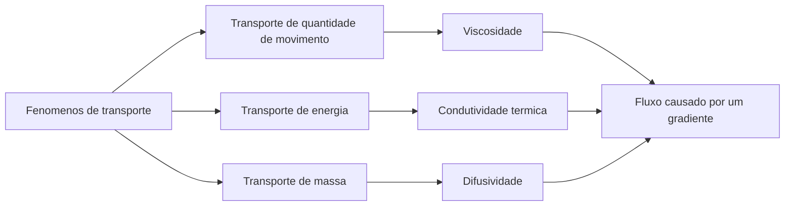

# Plano de Estudo de Transporte de Energia e Massa

Fonte principal: [`materials/pdfcoffee.com_livro-fenomenos-de-transporte-birdpdf-pdf-free.pdf`](../materials/pdfcoffee.com_livro-fenomenos-de-transporte-birdpdf-pdf-free.pdf)

Contexto da disciplina: HID-31 Fenomenos de Transporte.

Este plano usa o livro *Transport Phenomena*, de Bird, Stewart e Lightfoot, como referencia principal para estudar transporte de energia e transporte de massa. A ideia nao e ler as 850 paginas do inicio ao fim. A ideia e transformar o livro em um caminho menor de estudo, com notas claras, exemplos, formulas e material de revisao.

> Observacao: eu consegui confirmar que o PDF existe em `materials/`, mas as ferramentas de extracao direta de texto de PDF ainda nao estao disponiveis neste workspace. O mapa de capitulos abaixo segue a estrutura padrao do livro *Transport Phenomena*, de Bird. Um mapa detalhado de paginas deve ser adicionado depois que tivermos uma forma confiavel de extrair o texto do PDF.

## Objetivo de Estudo

Ao final desta sequencia, voce deve conseguir:

- explicar fluxo de calor e fluxo de massa em palavras simples;
- usar a lei de Fourier para conducao;
- usar a lei de Fick para difusao;
- montar balancos simples em cascas;
- reconhecer quando a conveccao e importante;
- entender as equacoes de conservacao de energia e de especies;
- conectar transporte de quantidade de movimento, calor e massa por analogia;
- resolver problemas basicos de prova passo a passo.

## Visao Geral

Fenomenos de transporte estudam como grandezas se movem:

| Grandeza transportada | Variavel principal | Lei de fluxo tipica | Forca motriz comum |
|---|---:|---:|---|
| Quantidade de movimento | velocidade, `v` | lei de Newton da viscosidade | gradiente de velocidade |
| Energia | temperatura, `T` | lei de Fourier | gradiente de temperatura |
| Massa | concentracao, `c_A` ou fracao massica | lei de Fick | gradiente de concentracao |



## Ordem Recomendada de Estudo

### 1. Revisar a linguagem comum dos transportes

Objetivo: entender o padrao que aparece em todos os topicos de transporte.

Estudar:

- fluxo: quantidade que atravessa uma area por unidade de tempo;
- gradiente: quao intensamente uma propriedade muda no espaco;
- balanco de conservacao: acumulacao = entrada - saida + geracao;
- propriedades materiais: viscosidade, condutividade termica e difusividade;
- problemas em regime permanente e transiente;
- problemas unidimensionais e multidimensionais.

Nota a criar:

- `notes/transport-phenomena-core-ideas.md`

### 2. Transporte de energia: significado fisico e lei de Fourier

Capitulos provaveis do Bird:

- Capitulo 8: condutividade termica e mecanismos de transporte de energia;
- Capitulo 9: balancos de energia em cascas e distribuicoes de temperatura.

Ideias principais:

- calor e energia em transferencia por causa de diferenca de temperatura;
- o fluxo de calor aponta das regioes quentes para as regioes frias;
- a lei de Fourier conecta o fluxo de calor ao gradiente de temperatura;
- a condutividade termica, `k`, mede a facilidade com que o calor passa por um material.

Formula central:

```text
q = -k dT/dx
```

onde:

- `q` = fluxo de calor, W/m^2;
- `k` = condutividade termica, W/(m.K);
- `T` = temperatura, K ou graus C;
- `x` = posicao, m.

Nota a criar:

- `notes/energy-transport-fourier-law.md`

### 3. Transporte de energia: balancos em cascas

Capitulo provavel do Bird:

- Capitulo 9: balancos de energia em cascas e distribuicoes de temperatura.

Ideias principais:

- escolher um volume de controle fino;
- escrever acumulacao, entrada, saida e geracao;
- simplificar usando hipoteses;
- resolver a distribuicao de temperatura.

Casos importantes:

- conducao de calor em uma parede plana;
- conducao de calor em um cilindro;
- conducao de calor com geracao interna;
- transferencia de calor em escoamento laminar simples.

Nota a criar:

- `notes/energy-shell-balances.md`

### 4. Transporte de energia: equacao de conservacao

Capitulo provavel do Bird:

- Capitulo 10: equacoes de variacao para sistemas nao isotermicos.

Ideias principais:

- a equacao de energia e a forma geral do balanco em cascas;
- a temperatura pode mudar por conducao, conveccao, trabalho e geracao;
- as hipoteses decidem quais termos permanecem.

Nota a criar:

- `notes/energy-conservation-equation.md`

### 5. Transporte de energia: conveccao e numeros adimensionais

Capitulos provaveis do Bird:

- Capitulo 13: transporte entre fases em sistemas nao isotermicos;
- Capitulo 14: balancos macroscopicos para sistemas nao isotermicos.

Ideias principais:

- conveccao combina movimento do fluido e transferencia de calor;
- o coeficiente de transferencia de calor, `h`, e um atalho empirico;
- numeros adimensionais ajudam a comparar sistemas.

Numeros adimensionais importantes:

| Numero | Significado |
|---|---|
| Numero de Reynolds, `Re` | regime do escoamento: laminar ou turbulento |
| Numero de Prandtl, `Pr` | difusividade de quantidade de movimento comparada com difusividade termica |
| Numero de Nusselt, `Nu` | transferencia convectiva de calor comparada com conducao pura |
| Numero de Peclet, `Pe` | conveccao comparada com difusao |

Nota a criar:

- `notes/energy-convection-and-dimensionless-numbers.md`

### 6. Transporte de massa: significado fisico e lei de Fick

Capitulo provavel do Bird:

- Capitulo 15: difusividade e mecanismos de transporte de massa.

Ideias principais:

- difusao de massa acontece porque a concentracao nao e uniforme;
- o fluxo de massa aponta da maior concentracao para a menor concentracao;
- a lei de Fick conecta o fluxo de massa ao gradiente de concentracao;
- a difusividade, `D_AB`, mede a facilidade com que a especie `A` se move atraves da especie `B`.

Formula central:

```text
J_A = -D_AB dc_A/dx
```

onde:

- `J_A` = fluxo molar difusivo da especie A, mol/(m^2.s);
- `D_AB` = difusividade binaria, m^2/s;
- `c_A` = concentracao molar da especie A, mol/m^3;
- `x` = posicao, m.

Nota a criar:

- `notes/mass-transport-ficks-law.md`

### 7. Transporte de massa: balancos em cascas

Capitulo provavel do Bird:

- Capitulo 16: distribuicoes de concentracao em solidos e em escoamento laminar.

Ideias principais:

- especies podem acumular, entrar, sair, reagir ou ser geradas;
- problemas de difusao frequentemente se parecem com problemas de conducao de calor;
- condicoes de contorno sao essenciais.

Casos importantes:

- difusao atraves de um filme estagnado;
- difusao atraves de uma parede plana;
- difusao com reacao quimica;
- evaporacao ou absorcao em uma interface.

Nota a criar:

- `notes/mass-shell-balances.md`

### 8. Transporte de massa: equacao de conservacao

Capitulo provavel do Bird:

- Capitulo 17: equacoes de variacao para sistemas multicomponentes.

Ideias principais:

- a equacao de conservacao de especies e a forma geral do balanco de massa;
- a concentracao muda por difusao, conveccao e reacao;
- o fluxo total pode incluir difusao molecular e movimento global do fluido.

Nota a criar:

- `notes/species-conservation-equation.md`

### 9. Transporte de massa: conveccao e transferencia entre fases

Capitulos provaveis do Bird:

- Capitulo 19: distribuicoes de concentracao em escoamento turbulento;
- Capitulo 20: transporte entre fases em misturas;
- Capitulo 21: balancos macroscopicos para sistemas multicomponentes.

Ideias principais:

- o coeficiente de transferencia de massa, `k_c`, e usado quando o perfil completo de concentracao e dificil;
- camadas limite de concentracao sao parecidas com camadas limite termicas;
- interfaces entre fases precisam de relacoes de equilibrio ou transferencia.

Numeros adimensionais importantes:

| Numero | Significado |
|---|---|
| Numero de Schmidt, `Sc` | difusividade de quantidade de movimento comparada com difusividade de massa |
| Numero de Sherwood, `Sh` | transferencia convectiva de massa comparada com difusao pura |
| Numero de Peclet para massa, `Pe_m` | conveccao comparada com difusao de massa |

Nota a criar:

- `notes/mass-convection-and-dimensionless-numbers.md`

### 10. Analogias entre quantidade de movimento, calor e massa

Objetivo: conectar a disciplina inteira.

Ideia principal: muitas equacoes tem a mesma forma matematica.

| Topico | Propriedade | Grandeza parecida com difusividade | Lei de fluxo |
|---|---:|---:|---|
| Quantidade de movimento | viscosidade, `mu` | viscosidade cinematica, `nu` | lei de Newton |
| Calor | condutividade termica, `k` | difusividade termica, `alpha` | lei de Fourier |
| Massa | difusividade, `D_AB` | difusividade de massa, `D_AB` | lei de Fick |

Nota a criar:

- `notes/transport-analogies.md`

## Plano Semanal Sugerido

| Semana | Foco | Principal resultado |
|---:|---|---|
| 1 | Ideias centrais de transporte e leis de fluxo | tabela-resumo e definicoes basicas |
| 2 | Lei de Fourier e conducao simples | exemplos resolvidos de parede/cilindro |
| 3 | Balancos de energia em cascas | modelos passo a passo de balanco |
| 4 | Equacao de energia e conveccao | folha de formulas de transferencia de calor |
| 5 | Lei de Fick e difusao simples | exemplos resolvidos de difusao |
| 6 | Balancos de especies em cascas | modelos de balanco de massa |
| 7 | Equacao de especies e transferencia de massa entre fases | notas sobre coeficiente de transferencia de massa |
| 8 | Analogias e revisao para prova | folha de revisao e questoes de pratica |

## Como Eu Posso Te Ajudar a Estudar

Para cada topico, podemos usar esta rotina:

1. Identificar a secao relevante do Bird.
2. Extrair as definicoes e equacoes importantes.
3. Reescrever o conceito em ingles simples ou portugues simples.
4. Adicionar um pequeno diagrama ou tabela.
5. Resolver um exemplo simples.
6. Adicionar erros comuns.
7. Criar 5 a 10 perguntas para prova oral.

## Primeiras Notas a Criar

Proximos arquivos recomendados:

1. `notes/transport-phenomena-core-ideas.md`
2. `notes/energy-transport-fourier-law.md`
3. `notes/mass-transport-ficks-law.md`
4. `reviews/energy-and-mass-transport-review.md`

## Proximo Passo Para Extracao do PDF

Para deixar este plano mais preciso, depois devemos adicionar:

- paginas exatas do PDF para cada capitulo;
- titulos exatos das secoes em portugues ou ingles, dependendo da edicao;
- figuras selecionadas do livro, salvas em `notes/images/`;
- referencias ao lado de cada secao das notas.

Melhor proximo passo tecnico:

- usar uma ferramenta de extracao de texto de PDF ou uma biblioteca Python de PDF para criar um indice de capitulos e paginas.

