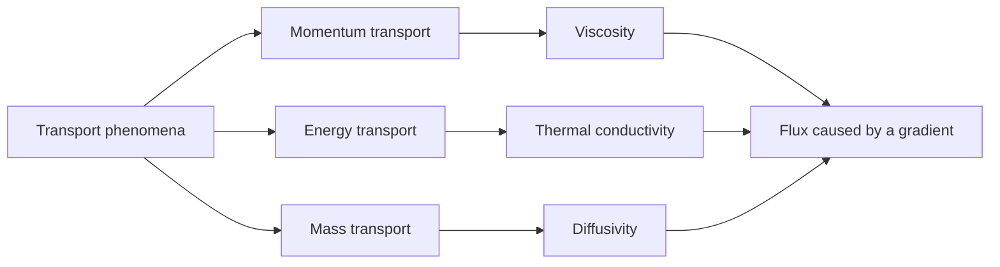

# Energy and Mass Transport Study Plan

Main source: [`materials/pdfcoffee.com_livro-fenomenos-de-transporte-birdpdf-pdf-free.pdf`](../materials/pdfcoffee.com_livro-fenomenos-de-transporte-birdpdf-pdf-free.pdf)

Course context: HID-31 Transport Phenomena.

This plan uses Bird, Stewart, and Lightfoot's *Transport Phenomena* as the main reference for studying energy transport and mass transport. The goal is not to read the 850 pages from beginning to end. The goal is to turn the book into a smaller learning path with clear notes, examples, formulas, and review material.

> Note: I could confirm that the PDF exists in `materials/`, but direct text extraction tools are not currently available in this workspace. The chapter map below follows the standard structure of Bird's *Transport Phenomena*. A detailed page map should be added after reliable PDF text extraction is available.

## Study Goal

By the end of this sequence, you should be able to:

- explain heat flux and mass flux in simple words;
- use Fourier's law for conduction;
- use Fick's law for diffusion;
- set up simple shell balances;
- recognize when convection matters;
- understand the conservation equations for energy and species;
- connect momentum, heat, and mass transport by analogy;
- solve basic exam-style problems step by step.

## Big Picture

Transport phenomena studies how quantities move:

| Quantity transported | Main field variable | Typical flux law | Common driving force |
|---|---:|---:|---|
| Momentum | velocity, `v` | Newton's law of viscosity | velocity gradient |
| Energy | temperature, `T` | Fourier's law | temperature gradient |
| Mass | concentration, `c_A` or mass fraction | Fick's law | concentration gradient |



## Recommended Learning Order

### 1. Review the common language of transport

Purpose: understand the repeated pattern behind all transport topics.

Study:

- flux: amount crossing an area per unit time;
- gradient: how strongly a property changes in space;
- conservation balance: accumulation = input - output + generation;
- material properties: viscosity, thermal conductivity, and diffusivity;
- steady vs. unsteady problems;
- one-dimensional vs. multidimensional problems.

Output note to create:

- `notes/transport-phenomena-core-ideas.md`

### 2. Energy transport: physical meaning and Fourier's law

Probable Bird chapters:

- Chapter 8: thermal conductivity and mechanisms of energy transport;
- Chapter 9: shell energy balances and temperature distributions.

Key ideas:

- heat is energy in transfer because of temperature difference;
- heat flux points from hot regions to cold regions;
- Fourier's law connects heat flux with temperature gradient;
- thermal conductivity, `k`, measures how easily heat moves through a material.

Core formula:

```text
q = -k dT/dx
```

where:

- `q` = heat flux, W/m^2;
- `k` = thermal conductivity, W/(m.K);
- `T` = temperature, K or degrees C;
- `x` = position, m.

Output note to create:

- `notes/energy-transport-fourier-law.md`

### 3. Energy transport: shell balances

Probable Bird chapter:

- Chapter 9: shell energy balances and temperature distributions.

Key ideas:

- choose a thin control volume;
- write accumulation, input, output, and generation;
- simplify using assumptions;
- solve for temperature distribution.

Important cases:

- heat conduction through a plane wall;
- heat conduction through a cylinder;
- heat conduction with internal generation;
- heat transfer in simple laminar flow.

Output note to create:

- `notes/energy-shell-balances.md`

### 4. Energy transport: conservation equation

Probable Bird chapter:

- Chapter 10: equations of change for nonisothermal systems.

Key ideas:

- the energy equation is the general form of the shell balance;
- temperature can change because of conduction, convection, work, and generation;
- assumptions decide which terms remain.

Output note to create:

- `notes/energy-conservation-equation.md`

### 5. Energy transport: convection and dimensionless numbers

Probable Bird chapters:

- Chapter 13: interphase transport in nonisothermal systems;
- Chapter 14: macroscopic balances for nonisothermal systems.

Key ideas:

- convection combines fluid motion and heat transfer;
- heat transfer coefficient, `h`, is an empirical shortcut;
- dimensionless numbers help compare systems.

Important dimensionless numbers:

| Number | Meaning |
|---|---|
| Reynolds number, `Re` | flow regime: laminar or turbulent |
| Prandtl number, `Pr` | momentum diffusivity compared with thermal diffusivity |
| Nusselt number, `Nu` | convective heat transfer compared with pure conduction |
| Peclet number, `Pe` | convection compared with diffusion |

Output note to create:

- `notes/energy-convection-and-dimensionless-numbers.md`

### 6. Mass transport: physical meaning and Fick's law

Probable Bird chapter:

- Chapter 15: diffusivity and mechanisms of mass transport.

Key ideas:

- mass diffusion happens because concentration is not uniform;
- mass flux points from high concentration to low concentration;
- Fick's law connects mass flux with concentration gradient;
- diffusivity, `D_AB`, measures how easily species `A` moves through species `B`.

Core formula:

```text
J_A = -D_AB dc_A/dx
```

where:

- `J_A` = diffusive molar flux of species A, mol/(m^2.s);
- `D_AB` = binary diffusivity, m^2/s;
- `c_A` = molar concentration of species A, mol/m^3;
- `x` = position, m.

Output note to create:

- `notes/mass-transport-ficks-law.md`

### 7. Mass transport: shell balances

Probable Bird chapter:

- Chapter 16: concentration distributions in solids and in laminar flow.

Key ideas:

- species can accumulate, enter, leave, react, or be generated;
- diffusion problems often look similar to heat conduction problems;
- boundary conditions are essential.

Important cases:

- diffusion through a stagnant film;
- diffusion through a plane wall;
- diffusion with chemical reaction;
- evaporation or absorption at an interface.

Output note to create:

- `notes/mass-shell-balances.md`

### 8. Mass transport: conservation equation

Probable Bird chapter:

- Chapter 17: equations of change for multicomponent systems.

Key ideas:

- the species conservation equation is the general form of the mass balance;
- concentration changes because of diffusion, convection, and reaction;
- total flux may include both molecular diffusion and bulk motion.

Output note to create:

- `notes/species-conservation-equation.md`

### 9. Mass transport: convection and interphase transfer

Probable Bird chapters:

- Chapter 19: concentration distributions in turbulent flow;
- Chapter 20: interphase transport in mixtures;
- Chapter 21: macroscopic balances for multicomponent systems.

Key ideas:

- mass transfer coefficient, `k_c`, is used when the full concentration profile is difficult;
- concentration boundary layers are similar to thermal boundary layers;
- phase interfaces need equilibrium or transfer relations.

Important dimensionless numbers:

| Number | Meaning |
|---|---|
| Schmidt number, `Sc` | momentum diffusivity compared with mass diffusivity |
| Sherwood number, `Sh` | convective mass transfer compared with pure diffusion |
| Peclet number for mass, `Pe_m` | convection compared with mass diffusion |

Output note to create:

- `notes/mass-convection-and-dimensionless-numbers.md`

### 10. Momentum, heat, and mass analogies

Purpose: connect the whole course.

Key idea: many equations have the same mathematical shape.

| Topic | Property | Diffusivity-like quantity | Flux law |
|---|---:|---:|---|
| Momentum | viscosity, `mu` | kinematic viscosity, `nu` | Newton's law |
| Heat | thermal conductivity, `k` | thermal diffusivity, `alpha` | Fourier's law |
| Mass | diffusivity, `D_AB` | mass diffusivity, `D_AB` | Fick's law |

Output note to create:

- `notes/transport-analogies.md`

## Suggested Weekly Plan

| Week | Focus | Main output |
|---:|---|---|
| 1 | Core transport ideas and flux laws | summary table and basic definitions |
| 2 | Fourier's law and simple conduction | solved wall/cylinder examples |
| 3 | Energy shell balances | step-by-step balance templates |
| 4 | Energy equation and convection | formula sheet for heat transfer |
| 5 | Fick's law and simple diffusion | solved diffusion examples |
| 6 | Species shell balances | mass balance templates |
| 7 | Species equation and interphase mass transfer | mass transfer coefficient notes |
| 8 | Analogies and exam review | review sheet and practice questions |

## How I Can Help You Study This

For each topic, we can use this routine:

1. Identify the relevant Bird section.
2. Extract the important definitions and equations.
3. Rewrite the concept in simple English.
4. Add a small diagram or table.
5. Solve one simple example.
6. Add common mistakes.
7. Create 5 to 10 oral-exam questions.

## First Notes to Create

Recommended next files:

1. `notes/transport-phenomena-core-ideas.md`
2. `notes/energy-transport-fourier-law.md`
3. `notes/mass-transport-ficks-law.md`
4. `reviews/energy-and-mass-transport-review.md`

## PDF Extraction Follow-Up

To make this plan more precise, we should later add:

- exact PDF pages for each chapter;
- exact section titles in Portuguese or English, depending on the edition;
- selected figures from the textbook, saved in `notes/images/`;
- references beside each note section.

Best next technical step:

- use a PDF text extraction tool or Python PDF library to create a chapter/page index.

